# SimpleMusic

音乐播放器 **Demo**，使用 **MVP** 模式构建。

## 已实现功能

* 播放/暂停
* 上一曲/下一曲
* 顺序播放
* 循环播放
* 随机播放
* 临时播放
* 记录最近播放
* 扫描本地音乐
* 通知栏控制器
* 添加/删除音乐
* 自建歌单
* 排序歌单
* 我喜欢
* 搜索音乐
* 多选操作
* 线控 暂停/播放
* 支持外设控制（例如：蓝牙耳机）

## 参考图

 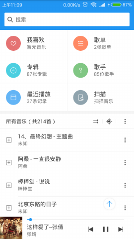 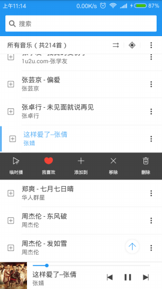

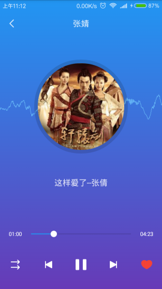!  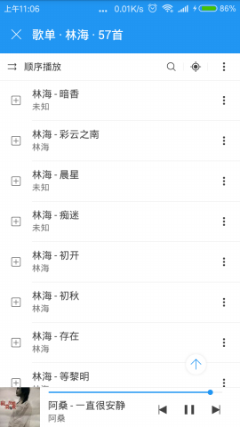 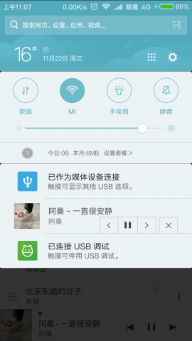

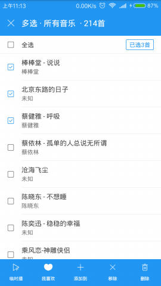 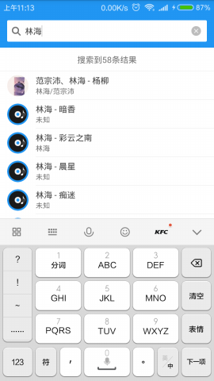 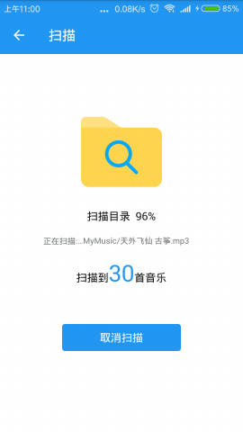

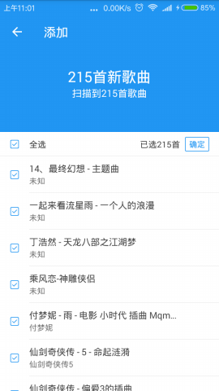 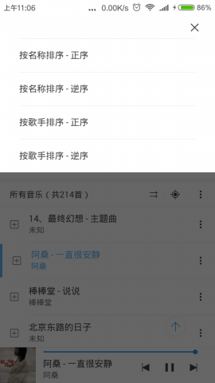 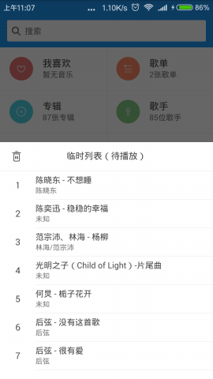

 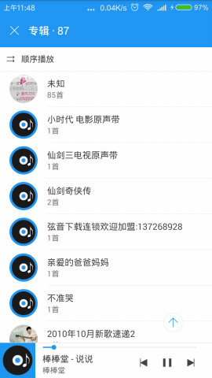 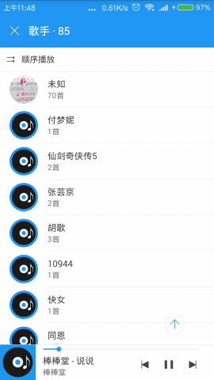

## 项目介绍

项目分为两个模块：

* **app** 模块：负责 **UI** 交互。
* **player** 模块：负责音乐播放与管理已添加的音乐。

**player** 模块独立于 **app** 模块，可以作为一个模块单独使用。

## License

`Apache 2.0`